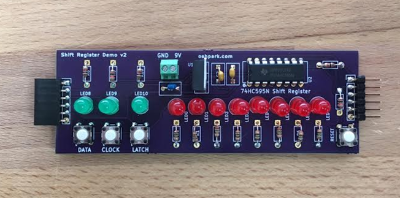
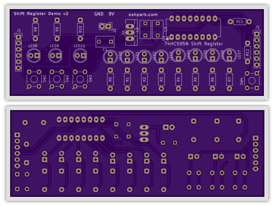
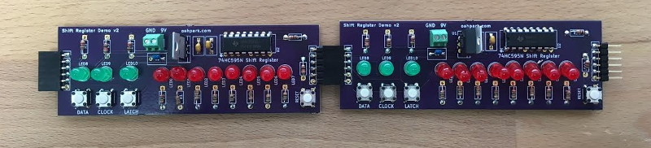
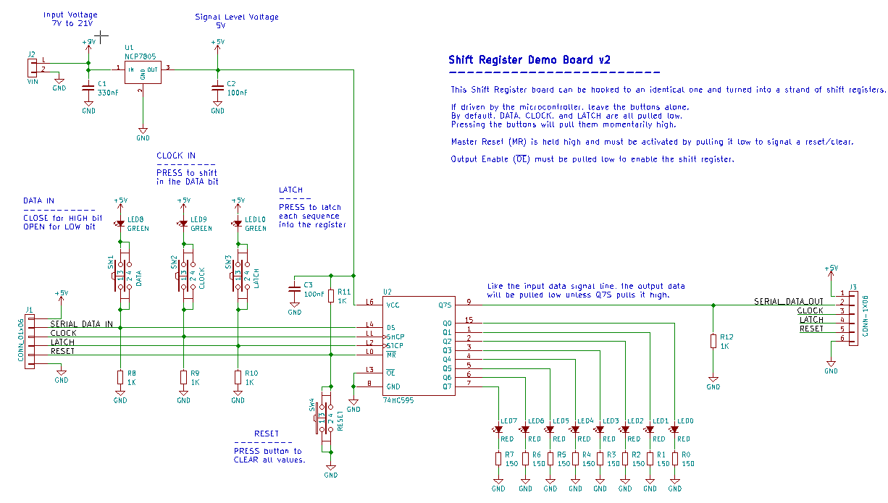

# Laen's Shift Register Demo v2

This is a project to convert Laen's shift register demonstration design into KiCad. The demo board provides eight output LEDs driven by an HC595 shift register with input press-buttons for data, clock, and latch.  

Each press of the clock button queues up the status of the data button; press the latch button to show the outputs. Reset everything by pressing the master reset button followed by the latch button.

The boards can be chained together by the connectors at each end. 

I've <a href="https://oshpark.com/projects/dWEtqIvz">shared the boards at OSH Park</a>, where you can buy a set of three for $28.85.

|Ref|Qty|Description|MF_Name|MF_PN|Digikey PN|
|---|---|-----------|-------|-----|----------|
|C1|1|CAP CER 0.33UF 50V X7R RADIAL|TDK|FK24X7R1H334K|445-5263-ND|
|C2-C3|2|CAP CER 0.1UF 50V C0G RADIAL|TDK|FK26C0G1H104J|445-8532-ND|
|J1|1|HEADER MALE 6POS TH 1x06 0.1”|Harwin|M20-9992046|952-1902-ND|
|J2|1|CONN TERM SCREW GREEN 2.54MM 2POS TH|OnShoreTech|OSTVN02A150|ED10561-ND|
|J3|1|HEADER FEMALE 6POS TH 1x06 0.1”|Harwin|M20-7820642|952-1808-ND|
|LED0-7|8|LED RED DIFF 5MM ROUND T/H|Marktech Opto|MT4118-HR-A|1125-1188-ND|
|LED8-10|3|LED GRN DIFF 5MM ROUND T/H|Marktech Opto|MT2118-G-A|1125-1184-ND|
|R0-R7|8|RES 150 OHM 1/4W 5% CF MINI|Stackpole|CFM14JT150R|S150QCT-ND|
|R8-R12|5|RES 1K OHM 1/4W 5% CF MINI|Stackpole|CFM14JT1K00|S1KQCT-ND|
|SW1-4|4| SWITCH TACTILE SPST-NO 0.05A 24V |Omron|B3F-1000|SW400-ND|
|U1|1|IC REG LDO 5V 1A NCP7805 TO220AB|ON Semi|NCP7805TG|NCP7805TGOS-ND|
|U2|1|IC 8-BIT SHIFT REGISTER 16-DIP|TI|SN74HC595N|296-1600-5-ND|

